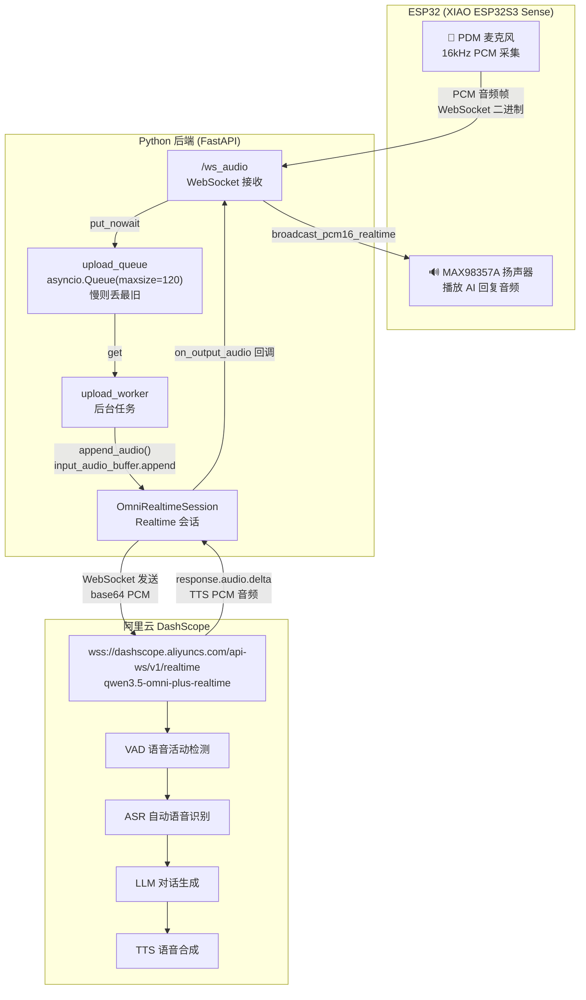

# ESP32 麦克风 → DashScope Realtime API 音频直传流程

> 本文档描述 **Realtime 模式**（`esp32_servo_control/server/omni_realtime_client.py`）下，ESP32 麦克风采集的原始 PCM 音频**不经过本地 ASR 转文字**，而是直接通过 WebSocket 转发给 DashScope Realtime API，由 LLM 服务端内部自动完成语音识别、对话生成和 TTS 合成的完整流程。

---

## 整体架构图



---

## 详细流程

### 1️⃣ ESP32 麦克风采集

- ESP32 使用板载 **PDM 麦克风**（CLK=GPIO42, DATA=GPIO41）采集音频
- 采样率 **16kHz**，PCM 格式
- 每 20ms 一个音频块（`BYTES_PER_CHUNK = 16000 * 20 / 1000 * 2 = 640` 字节）

### 2️⃣ WebSocket 上传到后端

- ESP32 通过 `/ws_audio` WebSocket 连接后端
- 连接建立后发送 `START` 命令，后端创建 Realtime 会话
- ESP32 将 PCM 音频帧以**二进制消息**持续上传

```python
# ESP32 侧（integrated.ino）
wsAud.sendBinary(audioChunk, chunkSize);
```

### 3️⃣ 后端接收与队列缓冲

后端 `ws_audio` 函数接收音频字节，放入**上行队列**：

```python
# 后端（esp32_servo_control/server/app.py）
elif "bytes" in msg and msg["bytes"]:
    if streaming and session is not None:
        data = msg["bytes"]
        # 丢进上行队列：慢则丢最旧，永远不阻塞接收 ESP32 mic 流
        if upload_queue.full():
            try:
                upload_queue.get_nowait()  # 丢弃最旧数据
            except Exception:
                pass
        try:
            upload_queue.put_nowait(data)
        except Exception as exc:
            print(f"[WS_AUDIO] upload queue error: {exc}", flush=True)
```

### 4️⃣ 后台 worker 转发到 Realtime 会话

独立的 `upload_worker` 后台任务从队列取数据，调用 `append_audio()`：

```python
async def upload_worker():
    while not upload_stop.is_set():
        try:
            data = await asyncio.wait_for(upload_queue.get(), timeout=0.5)
        except asyncio.TimeoutError:
            continue
        if data is None:
            break
        current_session = session
        if current_session is None:
            continue
        try:
            await current_session.append_audio(data)
        except Exception as exc:
            print(f"[WS_AUDIO] upload failed: {exc}", flush=True)
            break
```

### 5️⃣ 转发到 DashScope Realtime API

`append_audio()` 将 PCM 音频 **base64 编码**后，通过 WebSocket 发送 `input_audio_buffer.append` 事件：

```python
# omni_realtime_client.py
async def append_audio(self, pcm_chunk: bytes):
    if not pcm_chunk:
        return
    await self.ensure_connected()
    payload = base64.b64encode(pcm_chunk).decode("ascii")
    await self._send_event({"type": "input_audio_buffer.append", "audio": payload})
```

连接参数：

| 参数 | 值 |
|------|-----|
| WebSocket URL | `wss://dashscope.aliyuncs.com/api-ws/v1/realtime` |
| 模型 | `qwen3.5-omni-plus-realtime` |
| 输入音频格式 | `pcm` |
| 输出音频格式 | `pcm` |
| 语音 | `Sunnybobi` |
| VAD 检测 | `server_vad`（服务端自动检测） |
| 静音阈值 | `0.5` |
| 静音时长 | `900ms` |

### 6️⃣ LLM 服务端自动处理

DashScope Realtime 服务端收到音频后**自动完成**：

1. **VAD**（语音活动检测）：自动检测用户开始/停止说话
2. **ASR**（自动语音识别）：将语音转成文字（`gummy-realtime-v1` 转写模型）
3. **LLM 对话**：结合系统提示词和上下文生成回复
4. **TTS**（语音合成）：将回复文本合成为语音

### 7️⃣ 返回结果

服务端通过 WebSocket 返回多种事件：

| 事件类型 | 内容 |
|---------|------|
| `conversation.item.input_audio_transcription.completed` | 用户语音转写文本 |
| `response.text.delta` / `response.audio_transcript.delta` | AI 回复文字增量 |
| `response.audio.delta` | AI 回复音频增量（TTS PCM） |
| `input_audio_buffer.speech_started` | 检测到用户开始说话 |
| `input_audio_buffer.speech_stopped` | 检测到用户停止说话 |

### 8️⃣ 音频播放回 ESP32

`on_output_audio` 回调将 TTS 音频通过 `broadcast_pcm16_realtime` 发送给 ESP32 播放：

```python
async def on_output_audio(audio_bytes: bytes):
    pcm16 = audio_bytes  # 已是 PCM 格式
    if pcm16 and stream_clients:
        await broadcast_pcm16_realtime(pcm16)
```

ESP32 通过 `/stream.wav` HTTP 流式接口接收音频，由 MAX98357A 扬声器播放。

---

## 关键代码位置

| 文件 | 关键函数/类 | 作用 |
|------|------------|------|
| `esp32_servo_control/server/omni_realtime_client.py` | `OmniRealtimeSession` | Realtime 会话管理（连接、发送、接收） |
| `esp32_servo_control/server/omni_realtime_client.py` | `append_audio()` | 将 PCM 音频转发给 Realtime API |
| `esp32_servo_control/server/omni_realtime_client.py` | `_handle_messages()` | 处理服务端返回的事件 |
| `esp32_servo_control/server/app.py` | `ws_audio()` | WebSocket 接收 ESP32 音频 |
| `esp32_servo_control/server/app.py` | `upload_worker()` | 队列消费，转发音频到 Realtime |
| `esp32_servo_control/server/app.py` | `on_output_audio()` | 将 TTS 音频广播给 ESP32 |

---

## 与"先 ASR 转文字"模式的区别

| 特性 | Realtime 直传模式 | ASR 转文字模式（当前 integrated 版本） |
|------|------------------|--------------------------------------|
| 音频处理 | 原始 PCM 直接转发给 LLM | 先本地 ASR 转文字，再喂文字给 LLM |
| 延迟 | 更低（省去一次 API 往返） | 较高（ASR + LLM 两次调用） |
| 服务端能力 | 需要 Realtime API（`qwen3.5-omni-plus-realtime`） | 使用 ChatCompletions API（`qwen3-omni-flash`） |
| 视觉输入 | 通过 `input_image_buffer.append` 发送 | 通过 `image_url` 发送 base64 图片 |
| 代码位置 | `esp32_servo_control/`（旧版） | `upload_facial_expression/integrated/`（当前主版本） |