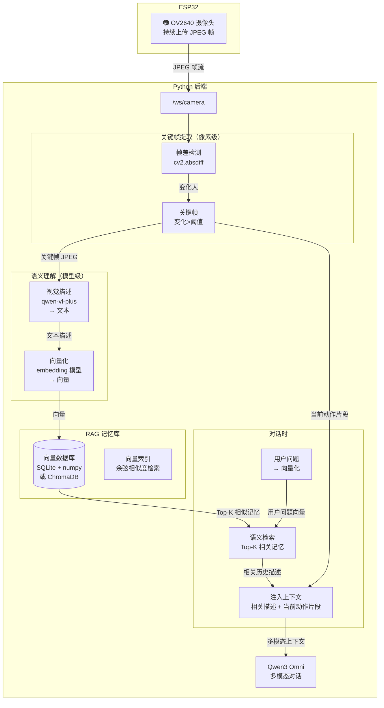
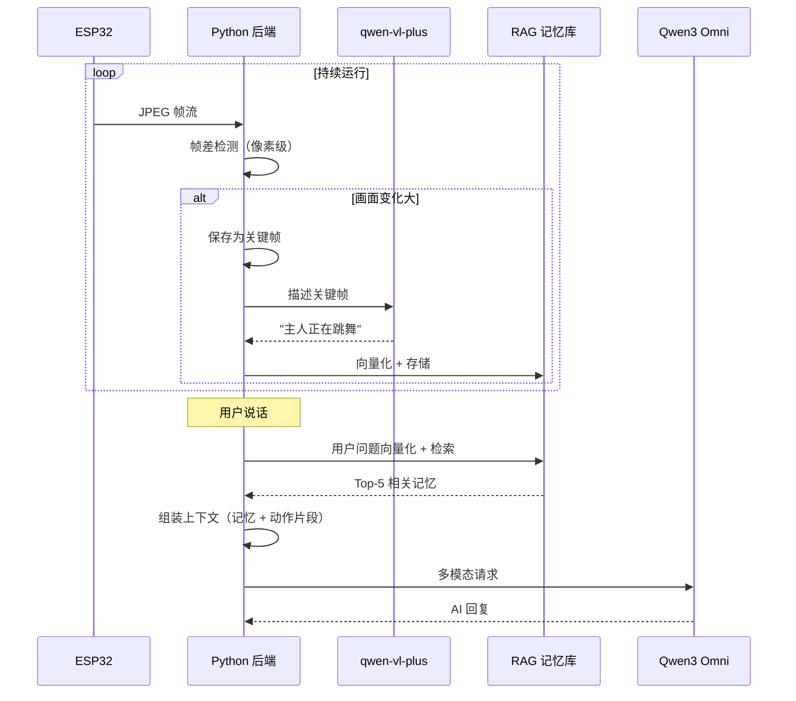

# 关键帧提取 + RAG 记忆方案

> 分析"关键帧提取"方案的优缺点，并设计一套结合 **RAG（检索增强生成）** 的完整记忆系统，让猫既能理解实时动作，又能回答长期记忆问题。

---

## 一、关键帧提取方案的优缺点分析

### ✅ 优点

| 优点 | 说明 |
|------|------|
| **减少冗余** | 画面静止时不保存帧，只保留变化大的帧 |
| **Token 可控** | 每次对话只发 3-5 帧，成本可控 |
| **实时性好** | 帧差检测是纯像素计算，延迟低 |
| **实现简单** | 只需 OpenCV 几行代码 |

### ❌ 缺点

| 缺点 | 说明 |
|------|------|
| **像素级判断，无语义** | 帧差检测只比较像素差异，不理解"语义变化"。例如：主人换了个姿势但画面差异不大 → 漏掉；画面在动但内容没变（如风扇转动）→ 误判 |
| **无法回答长期问题** | 关键帧只保留最近 5-10 秒，无法回答"上周你在做什么" |
| **上下文窗口有限** | 多帧图片 token 消耗大，无法塞入大量历史帧 |
| **无检索能力** | 无法根据用户问题精准找到相关历史画面 |

### 核心问题

> **关键帧提取解决了"实时动作理解"，但解决不了"长期记忆检索"。**
> 这正是 RAG 的用武之地。

---

## 二、关键帧 + RAG 整体架构



---

## 三、为什么需要 RAG？

### 场景对比

| 场景 | 关键帧提取（无 RAG） | 关键帧 + RAG |
|------|---------------------|-------------|
| "主人刚才在做什么？" | ✅ 能（最近 5-10 秒） | ✅ 能 |
| "主人今天下午在做什么？" | ❌ 不能（帧已丢弃） | ✅ 能（检索到相关描述） |
| "主人上周有没有跳舞？" | ❌ 不能 | ✅ 能（检索到历史记录） |
| "主人经常什么时候用电脑？" | ❌ 不能 | ✅ 能（统计分析） |
| "主人刚才在跳舞吗？" | ⚠️ 勉强（像素级判断） | ✅ 能（语义级理解） |

### RAG 解决的核心问题

1. **长期记忆**：关键帧只保留几秒，RAG 把描述存到数据库，可长期保留
2. **语义检索**：用户问"主人刚才在做什么"，RAG 能精准找到相关描述，而不是把所有历史都塞给 LLM
3. **Token 控制**：只注入 Top-K 条相关记忆，而不是全部历史
4. **语义理解**：视觉模型描述是"语义级"的，比像素级帧差更准确

---

## 四、完整实现

### 4.1 数据流

```
关键帧 JPEG
    ↓
qwen-vl-plus 描述 → "主人正在跳舞，动作幅度很大"
    ↓
embedding 向量化 → [0.12, -0.34, 0.56, ...]
    ↓
存入向量数据库（带时间戳、原始描述、图片路径）
    ↓
用户问："主人刚才在做什么？"
    ↓
问题向量化 → 余弦相似度检索 → Top-5 相关记忆
    ↓
注入 LLM 上下文
```

### 4.2 向量数据库选择

| 方案 | 优点 | 缺点 | 适合场景 |
|------|------|------|---------|
| **SQLite + numpy** | 零依赖、轻量 | 检索慢（数据量大时） | 本项目（数据量小） |
| **ChromaDB** | 纯 Python、易用 | 需安装依赖 | 推荐 |
| **FAISS** | 高性能 | 需安装、配置复杂 | 数据量大时 |
| **Milvus** | 分布式 | 太重 | 不适合本项目 |

**推荐：ChromaDB**（轻量、纯 Python、支持持久化）

### 4.3 核心模块：`memory_rag.py`

```python
# memory_rag.py
# -*- coding: utf-8 -*-
"""
关键帧 + RAG 记忆系统
- 关键帧提取（像素级）→ 视觉描述（语义级）→ 向量化存储（RAG）
- 对话时：用户问题 → 向量检索 → 注入相关记忆
"""
import asyncio
import os
import time
import base64
from typing import List, Dict, Any, Optional, Tuple

# 向量数据库（推荐 ChromaDB）
try:
    import chromadb
    from chromadb.config import Settings
    CHROMA_AVAILABLE = True
except ImportError:
    CHROMA_AVAILABLE = False

# 嵌入模型（DashScope 文本向量化）
from openai import OpenAI

EMBED_MODEL = "text-embedding-v3"  # DashScope 文本向量模型
EMBED_DIM = 1024

# 配置
MEMORY_DIR = os.path.join(os.path.dirname(os.path.abspath(__file__)), "data", "memory")
COLLECTION_NAME = "activity_memory"
TOP_K = 5                    # 检索 Top-K 条记忆
MIN_SIMILARITY = 0.3         # 最小相似度阈值
DESCRIBE_INTERVAL = 10.0     # 每 10 秒描述一次
MAX_MEMORY_DAYS = 7          # 记忆保留天数


class MemoryRAG:
    """关键帧 + RAG 记忆系统"""

    def __init__(self):
        self._client = OpenAI(
            api_key=os.getenv("DASHSCOPE_API_KEY"),
            base_url="https://dashscope.aliyuncs.com/compatible-mode/v1",
        )
        self._init_vector_db()
        self._task: Optional[asyncio.Task] = None
        self._active = False

    def _init_vector_db(self):
        """初始化向量数据库"""
        os.makedirs(MEMORY_DIR, exist_ok=True)
        if CHROMA_AVAILABLE:
            self._chroma = chromadb.PersistentClient(
                path=MEMORY_DIR,
                settings=Settings(anonymized_telemetry=False),
            )
            self._collection = self._chroma.get_or_create_collection(
                name=COLLECTION_NAME,
                metadata={"hnsw:space": "cosine"},  # 余弦相似度
            )
        else:
            # 降级：SQLite + numpy 简单实现
            self._collection = None
            self._init_sqlite_fallback()

    def _init_sqlite_fallback(self):
        """SQLite + numpy 降级实现"""
        import sqlite3
        import numpy as np
        self._sqlite = sqlite3.connect(os.path.join(MEMORY_DIR, "memory_fallback.db"))
        self._sqlite.execute("""
            CREATE TABLE IF NOT EXISTS memories (
                id          INTEGER PRIMARY KEY AUTOINCREMENT,
                timestamp   REAL NOT NULL,
                time_label  TEXT NOT NULL,
                description TEXT NOT NULL,
                embedding   BLOB NOT NULL,      # numpy 向量序列化
                image_path  TEXT
            )
        """)
        self._sqlite.commit()

    # ===== 向量化 =====
    def _embed_text(self, text: str) -> List[float]:
        """文本向量化"""
        try:
            resp = self._client.embeddings.create(
                model=EMBED_MODEL,
                input=text,
            )
            return resp.data[0].embedding
        except Exception as exc:
            print(f"[RAG] Embedding failed: {exc}", flush=True)
            return [0.0] * EMBED_DIM

    # ===== 写入记忆 =====
    async def add_memory(self, jpeg_bytes: bytes, description: str):
        """保存一条记忆：描述 + 向量 + 图片"""
        now = time.time()
        time_label = time.strftime("%H:%M:%S", time.localtime(now))
        embedding = self._embed_text(description)

        # 保存图片（可选）
        image_path = None
        if os.getenv("SAVE_MEMORY_IMAGES", "0") == "1":
            image_path = self._save_image(jpeg_bytes, time.strftime("%Y%m%d"))

        if self._collection is not None:
            # ChromaDB 存储
            self._collection.add(
                ids=[f"mem_{int(now * 1000)}"],
                embeddings=[embedding],
                documents=[description],
                metadatas=[{
                    "timestamp": now,
                    "time_label": time_label,
                    "image_path": image_path or "",
                }],
            )
        else:
            # SQLite 降级
            import numpy as np
            self._sqlite.execute(
                "INSERT INTO memories (timestamp, time_label, description, embedding, image_path) VALUES (?,?,?,?,?)",
                (now, time_label, description, np.array(embedding, dtype=np.float32).tobytes(), image_path),
            )
            self._sqlite.commit()

        print(f"[RAG] 记忆已保存: [{time_label}] {description}", flush=True)

    def _save_image(self, jpeg_bytes: bytes, session: str) -> str:
        """保存关键帧图片"""
        dir_path = os.path.join(MEMORY_DIR, "images", session)
        os.makedirs(dir_path, exist_ok=True)
        filename = f"{int(time.time() * 1000)}.jpg"
        path = os.path.join(dir_path, filename)
        with open(path, "wb") as f:
            f.write(jpeg_bytes)
        return os.path.relpath(path, MEMORY_DIR)

    # ===== 检索记忆 =====
    def retrieve(self, query: str, top_k: int = TOP_K) -> List[Dict[str, Any]]:
        """语义检索：用户问题 → 向量 → Top-K 相关记忆"""
        query_embedding = self._embed_text(query)

        if self._collection is not None:
            # ChromaDB 检索
            results = self._collection.query(
                query_embeddings=[query_embedding],
                n_results=top_k,
            )
            memories = []
            for i, doc in enumerate(results["documents"][0]):
                meta = results["metadatas"][0][i]
                distance = results["distances"][0][i]
                similarity = 1 - distance  # 余弦距离 → 相似度
                if similarity >= MIN_SIMILARITY:
                    memories.append({
                        "time_label": meta.get("time_label", ""),
                        "description": doc,
                        "similarity": similarity,
                        "image_path": meta.get("image_path", ""),
                    })
            return memories
        else:
            # SQLite 降级：暴力检索
            import numpy as np
            rows = self._sqlite.execute(
                "SELECT time_label, description, embedding, image_path FROM memories ORDER BY id DESC LIMIT 500"
            ).fetchall()
            q_vec = np.array(query_embedding, dtype=np.float32)
            memories = []
            for time_label, desc, emb_blob, img_path in rows:
                emb = np.frombuffer(emb_blob, dtype=np.float32)
                sim = float(np.dot(q_vec, emb) / (np.linalg.norm(q_vec) * np.linalg.norm(emb) + 1e-8))
                if sim >= MIN_SIMILARITY:
                    memories.append({
                        "time_label": time_label,
                        "description": desc,
                        "similarity": sim,
                        "image_path": img_path or "",
                    })
            memories.sort(key=lambda x: x["similarity"], reverse=True)
            return memories[:top_k]

    def format_context(self, memories: List[Dict[str, Any]]) -> str:
        """把检索到的记忆格式化为 LLM 上下文"""
        if not memories:
            return ""
        lines = []
        for m in memories:
            lines.append(f"[{m['time_label']}] {m['description']} (相关度: {m['similarity']:.2f})")
        return "\n".join(lines)

    # ===== 定时描述任务 =====
    async def start(self):
        """启动定时描述任务"""
        if self._task and not self._task.done():
            return
        self._active = True
        self._task = asyncio.create_task(self._loop())

    async def stop(self):
        self._active = False
        if self._task:
            self._task.cancel()
            try:
                await self._task
            except asyncio.CancelledError:
                pass
            self._task = None

    async def _loop(self):
        while self._active:
            try:
                await self._tick()
            except Exception as exc:
                print(f"[RAG] tick failed: {exc}", flush=True)
            await asyncio.sleep(DESCRIBE_INTERVAL)

    async def _tick(self):
        """定时：抓关键帧 → 描述 → 存 RAG"""
        from app import last_frames, motion_analyzer
        if not last_frames:
            return
        # 只在有动作时保存记忆（避免存大量静止画面）
        if not motion_analyzer.is_motion_active():
            return
        _, jpeg_bytes = last_frames[-1]
        # 视觉描述
        from omni_client import describe_image_async
        description = await describe_image_async(jpeg_bytes)
        if not description or "没有看清" in description:
            return
        await self.add_memory(jpeg_bytes, description)


# 全局单例
memory_rag = MemoryRAG()
```

### 4.4 对话时注入 RAG 记忆

```python
# start_ai_with_text 中注入 RAG 记忆
async def start_ai_with_text(user_text: str):
    content_list = []

    # 1️⃣ RAG 语义检索：根据用户问题找到相关历史记忆
    memories = memory_rag.retrieve(user_text, top_k=5)
    if memories:
        memory_context = memory_rag.format_context(memories)
        content_list.append({
            "type": "text",
            "text": f"【相关历史记忆】\n{memory_context}\n\n"
        })
        print(f"[RAG] 检索到 {len(memories)} 条相关记忆", flush=True)

    # 2️⃣ 当前动作片段（关键帧，多帧）
    clip = motion_analyzer.get_action_clip()
    if clip:
        for jpeg_bytes in clip[-5:]:
            img_b64 = base64.b64encode(jpeg_bytes).decode("ascii")
            content_list.append({
                "type": "image_url",
                "image_url": {"url": f"data:image/jpeg;base64,{img_b64}"}
            })

    content_list.append({"type": "text", "text": user_text})
    # ... 原有逻辑 ...
```

### 4.5 系统提示词增强

```python
SYSTEM_PROMPT = """你是一匹活泼可爱的小马，名字叫"卧地马"，是一个桌面AI宠物。

【记忆与视觉理解】
- 你会收到【相关历史记忆】（带时间戳的文本描述）和【当前动作片段】（多张连续照片）
- 历史记忆是之前观察到的画面描述，按时间排列
- 当前动作片段是最近几秒的连续画面
- 结合两者回答主人的问题，例如：
  - 主人问"我刚才在做什么？" → 参考历史记忆和当前画面回答
  - 主人问"我经常什么时候用电脑？" → 从历史记忆中总结规律
  - 主人问"我上周有没有跳舞？" → 检索历史记忆中的"跳舞"相关记录
- 如果记忆中没有相关信息，诚实说"我好像没注意到"

【原有性格设定】
- ...（保留原有内容）"""
```

---

## 五、关键帧提取 + RAG 的完整流程



---

## 六、关键帧提取 + RAG 的优势

| 能力 | 关键帧提取（无 RAG） | 关键帧 + RAG |
|------|---------------------|-------------|
| 实时动作理解 | ✅ | ✅ |
| 长期记忆 | ❌ | ✅ |
| 语义检索 | ❌ | ✅ |
| 精准回答 | ⚠️ 像素级 | ✅ 语义级 |
| Token 控制 | 固定 3-5 帧 | 只注入相关记忆 |
| 成本 | 中 | 中（检索只花少量 token） |

---

## 七、依赖安装

```bash
# 向量数据库（推荐）
pip install chromadb

# 图像处理（帧差检测）
pip install opencv-python numpy

# 已有依赖
# openai（用于 embedding）
```

---

## 八、配置项（`.env`）

```bash
# RAG 记忆配置
RAG_ENABLED=1                # 是否启用 RAG
RAG_TOP_K=5                  # 检索 Top-K 条记忆
RAG_MIN_SIMILARITY=0.3       # 最小相似度阈值
RAG_DESCRIBE_INTERVAL=10     # 每 N 秒描述一次
RAG_MAX_DAYS=7               # 记忆保留天数
SAVE_MEMORY_IMAGES=0         # 是否保存记忆图片（默认关）
```

---

## 九、总结

**关键帧提取本身是好的**，但单独使用有局限：

1. **像素级判断不够语义化**：帧差检测无法理解"主人换姿势"和"风扇转动"的区别
2. **无法长期记忆**：关键帧只保留几秒，无法回答长期问题
3. **无检索能力**：无法根据用户问题精准找到相关历史

**关键帧 + RAG 是完整方案**：

```
关键帧提取（像素级，实时）
    ↓
视觉描述（语义级，qwen-vl-plus）
    ↓
向量化存储（RAG，ChromaDB）
    ↓
对话时语义检索（用户问题 → Top-K 相关记忆）
    ↓
注入 LLM 上下文（记忆 + 当前动作片段）
```

这样猫既能理解"主人刚才在跳舞"（实时动作片段），又能回答"主人上周在做什么"（RAG 长期记忆），还能精准检索"主人经常什么时候用电脑"（语义检索）。