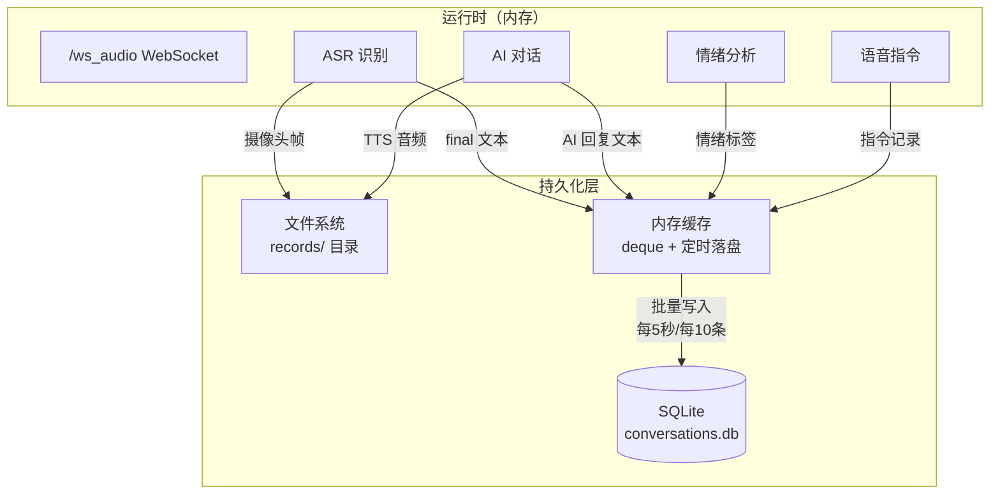

# 持久化设计方案

> 当前项目所有数据（对话、情绪、识别文本、摄像头帧）都只存在于**内存**中，重启即丢失。本文档设计一套轻量级持久化方案，覆盖对话历史、情绪记录、语音指令、摄像头帧、音频等数据。

---

## 一、需要持久化的数据

| 数据 | 当前状态 | 建议存储 | 优先级 |
|------|---------|---------|--------|
| 对话历史（用户语音转写 + AI 回复） | 内存 `recent_finals`（50条） | SQLite | ⭐⭐⭐ |
| 情绪分析结果 | 内存，仅实时发送 | SQLite | ⭐⭐⭐ |
| 语音指令触发记录 | 无 | SQLite | ⭐⭐ |
| 摄像头帧（视觉上下文） | 内存 `last_frames`（10帧） | 文件系统（可选） | ⭐⭐ |
| AI 回复音频（TTS） | 不保存 | 文件系统（可选） | ⭐ |
| 系统事件日志 | 无 | SQLite / 日志文件 | ⭐⭐ |
| OpenClaw 事件记录 | 内存 `openclaw_records`（6条） | SQLite | ⭐ |

---

## 二、整体架构



---

## 三、数据库设计（SQLite）

### 3.1 表结构

```sql
-- 对话记录表
CREATE TABLE IF NOT EXISTS conversations (
    id          INTEGER PRIMARY KEY AUTOINCREMENT,
    session_id  TEXT NOT NULL,              -- 会话ID（按天或按连接）
    role        TEXT NOT NULL,              -- 'user' / 'assistant'
    content     TEXT NOT NULL,              -- 文本内容
    emotion     TEXT,                       -- 情绪标签（happy/sad/...）
    anim_id     INTEGER,                    -- 对应表情动画编号
    audio_path  TEXT,                       -- TTS音频文件路径（可选）
    image_path  TEXT,                       -- 摄像头帧路径（可选）
    created_at  REAL NOT NULL               -- Unix 时间戳
);

-- 语音指令记录表
CREATE TABLE IF NOT EXISTS voice_commands (
    id          INTEGER PRIMARY KEY AUTOINCREMENT,
    session_id  TEXT NOT NULL,
    text        TEXT NOT NULL,              -- 用户语音文本
    command     TEXT NOT NULL,              -- 匹配到的指令（SIT/RUN/...）
    keyword     TEXT,                       -- 匹配到的关键词
    created_at  REAL NOT NULL
);

-- 系统事件日志表
CREATE TABLE IF NOT EXISTS system_events (
    id          INTEGER PRIMARY KEY AUTOINCREMENT,
    event_type  TEXT NOT NULL,              -- 'asr_start'/'tts_play'/'error'/...
    message     TEXT,
    created_at  REAL NOT NULL
);

-- 索引
CREATE INDEX idx_conv_session ON conversations(session_id);
CREATE INDEX idx_conv_time    ON conversations(created_at);
CREATE INDEX idx_cmd_time     ON voice_commands(created_at);
```

### 3.2 数据库文件位置

```
upload_facial_expression/integrated/server/
├── app.py
├── data/                    # 新增
│   ├── conversations.db     # SQLite 数据库
│   ├── images/              # 摄像头帧
│   │   └── 20260808/
│   │       └── 1723100000_0001.jpg
│   └── audio/               # TTS 音频
│       └── 20260808/
│           └── 1723100000_0001.wav
└── ...
```

---

## 四、核心模块设计

### 4.1 持久化管理器（`persistence.py`）

```python
# persistence.py
# -*- coding: utf-8 -*-
"""
轻量级持久化模块：SQLite + 文件系统
- 对话/情绪/指令 → SQLite
- 图片/音频 → 文件系统
- 内存缓存 + 批量落盘，避免频繁 IO
"""
import os
import json
import sqlite3
import threading
import time
from collections import deque
from typing import Any, Dict, List, Optional

DATA_DIR = os.path.join(os.path.dirname(os.path.abspath(__file__)), "data")
DB_PATH = os.path.join(DATA_DIR, "conversations.db")
IMAGE_DIR = os.path.join(DATA_DIR, "images")
AUDIO_DIR = os.path.join(DATA_DIR, "audio")

# 内存缓存上限
CACHE_MAX = 200
# 落盘策略：每 N 条或每 N 秒
FLUSH_BATCH = 10
FLUSH_INTERVAL = 5.0


class Persistence:
    def __init__(self):
        os.makedirs(IMAGE_DIR, exist_ok=True)
        os.makedirs(AUDIO_DIR, exist_ok=True)
        self._conn = sqlite3.connect(DB_PATH, check_same_thread=False)
        self._conn.execute("PRAGMA journal_mode=WAL")
        self._init_tables()
        self._cache: deque = deque(maxlen=CACHE_MAX)
        self._lock = threading.Lock()
        self._last_flush = time.time()
        self._stop = False
        self._worker = threading.Thread(target=self._flush_loop, daemon=True)
        self._worker.start()

    def _init_tables(self):
        self._conn.executescript("""
            CREATE TABLE IF NOT EXISTS conversations (
                id          INTEGER PRIMARY KEY AUTOINCREMENT,
                session_id  TEXT NOT NULL,
                role        TEXT NOT NULL,
                content     TEXT NOT NULL,
                emotion     TEXT,
                anim_id     INTEGER,
                audio_path  TEXT,
                image_path  TEXT,
                created_at  REAL NOT NULL
            );
            CREATE TABLE IF NOT EXISTS voice_commands (
                id          INTEGER PRIMARY KEY AUTOINCREMENT,
                session_id  TEXT NOT NULL,
                text        TEXT NOT NULL,
                command     TEXT NOT NULL,
                keyword     TEXT,
                created_at  REAL NOT NULL
            );
            CREATE TABLE IF NOT EXISTS system_events (
                id          INTEGER PRIMARY KEY AUTOINCREMENT,
                event_type  TEXT NOT NULL,
                message     TEXT,
                created_at  REAL NOT NULL
            );
            CREATE INDEX IF NOT EXISTS idx_conv_session ON conversations(session_id);
            CREATE INDEX IF NOT EXISTS idx_conv_time    ON conversations(created_at);
            CREATE INDEX IF NOT EXISTS idx_cmd_time     ON voice_commands(created_at);
        """)
        self._conn.commit()

    # ===== 写入接口（先入缓存） =====
    def add_conversation(self, session_id: str, role: str, content: str,
                         emotion: str = None, anim_id: int = None,
                         audio_path: str = None, image_path: str = None):
        with self._lock:
            self._cache.append(("conversation", {
                "session_id": session_id, "role": role, "content": content,
                "emotion": emotion, "anim_id": anim_id,
                "audio_path": audio_path, "image_path": image_path,
                "created_at": time.time(),
            }))

    def add_voice_command(self, session_id: str, text: str, command: str, keyword: str = None):
        with self._lock:
            self._cache.append(("voice_command", {
                "session_id": session_id, "text": text,
                "command": command, "keyword": keyword,
                "created_at": time.time(),
            }))

    def add_system_event(self, event_type: str, message: str = None):
        with self._lock:
            self._cache.append(("system_event", {
                "event_type": event_type, "message": message,
                "created_at": time.time(),
            }))

    # ---------- 批量落盘 ----------
    def _flush(self):
        with self._lock:
            items = list(self._cache)
            self._cache.clear()
        if not items:
            return
        with self._conn:
            for kind, data in items:
                if kind == "conversation":
                    self._conn.execute(
                        """INSERT INTO conversations
                           (session_id, role, content, emotion, anim_id, audio_path, image_path, created_at)
                           VALUES (?,?,?,?,?,?,?,?)""",
                        (data["session_id"], data["role"], data["content"],
                         data["emotion"], data["anim_id"],
                         data["audio_path"], data["image_path"], data["created_at"]),
                    )
                elif kind == "voice_command":
                    self._conn.execute(
                        """INSERT INTO voice_commands (session_id, text, command, keyword, created_at)
                           VALUES (?, ?, ?, ?, ?)""",
                        (data["session_id"], data["text"], data["command"],
                         data["keyword"], data["created_at"]),
                    )
                elif kind == "system_event":
                    self._conn.execute(
                        """INSERT INTO system_events (event_type, message, created_at)
                           VALUES (?, ?, ?)""",
                        (data["event_type"], data["message"], data["created_at"]),
                    )

    def _flush_loop(self):
        while not self._stop.is_set():
            time.sleep(FLUSH_INTERVAL)
            self._flush()

    # ---------- 查询接口 ----------
    def get_recent_conversations(self, limit: int = 20) -> List[Dict[str, Any]]:
        rows = self._conn.execute(
            "SELECT * FROM conversations ORDER BY id DESC LIMIT ?", (limit,)
        ).fetchall()
        return [dict(zip([d[0] for d in self._conn.description], r)) for r in rows]

    def get_conversations_by_session(self, session_id: str, limit: int = 50) -> List[Dict[str, Any]]:
        rows = self._conn.execute(
            "SELECT * FROM conversations WHERE session_id = ? ORDER BY id DESC LIMIT ?",
            (session_id, limit),
        ).fetchall()
        return [dict(zip([d[0] for d in self._conn.description], r)) for r in rows]

    def close(self):
        self._stop.set()
        self._flush()
        self._conn.close()


# 全局单例
persistence = Persistence()
```

### 4.2 文件保存工具（`file_store.py`）

```python
# file_store.py
# -*- coding: utf-8 -*-
"""大文件（图片/音频）保存工具"""
import os
import time
from persistence import IMAGE_DIR, AUDIO_DIR


def save_image(jpeg_bytes: bytes, session_id: str = None) -> str:
    """保存摄像头帧，返回相对路径"""
    session_id = session_id or time.strftime("%Y%m%d")
    dir_path = os.path.join(IMAGE_DIR, session_id)
    os.makedirs(dir_path, exist_ok=True)
    filename = f"{int(time.time() * 1000)}.jpg"
    path = os.path.join(dir_path, filename)
    with open(path, "wb") as f:
        f.write(jpeg_bytes)
    return os.path.relpath(path, IMAGE_DIR)


def save_audio(pcm_bytes: bytes, sample_rate: int = 24000, session_id: str = None) -> str:
    """保存 TTS 音频为 WAV 文件，返回相对路径"""
    import wave
    session_id = session_id or time.strftime("%Y%m%d")
    dir_path = os.path.join(AUDIO_DIR, session_id)
    os.makedirs(dir_path, exist_ok=True)
    filename = f"{int(time.time() * 1000)}.wav"
    path = os.path.join(dir_path, filename)
    with wave.open(path, "wb") as wf:
        wf.setnchannels(1)
        wf.setsampwidth(2)
        wf.setframerate(sample_rate)
        wf.writeframes(pcm_bytes)
    return os.path.relpath(path, AUDIO_DIR)
```

---

## 五、接入现有代码

### 5.1 对话记录（`app.py` 的 `start_ai_with_text`）

```python
# 在 start_ai_with_text 中接入
from persistence import persistence
from file_store import save_audio, save_image

async def start_ai_with_text(user_text: str):
    # ... 原有逻辑 ...

    # 记录用户消息
    persistence.add_conversation(
        session_id=time.strftime("%Y%m%d"),
        role="user",
        content=user_text,
    )

    # 记录 AI 回复（在流式结束后）
    final_text = ("".join(txt_buf)).strip() or "（空响应）"
    persistence.add_conversation(
        session_id=time.strftime("%Y%m%d"),
        role="ai",
        content=final_text,
        emotion=emotion,          # 情绪分析结果
        anim_id=anim_id,          # 表情动画编号
        audio_path=audio_path,    # 可选：TTS 音频文件
        image_path=image_path,    # 可选：摄像头帧
    )
```

### 5.2 语音指令记录（`voice_command.py` 匹配后）

```python
# 在匹配到语音指令时
from persistence import add_voice_command

command, keyword = match_voice_command(text)
if command:
    add_voice_command(
        session_id=time.strftime("%Y%m%d"),
        text=text,
        command=command,
        keyword=keyword,
    )
```

### 5.3 系统事件（连接/断开/错误）

```python
# WebSocket 连接/断开时
from persistence import add_system_event

# 连接
add_system_event("esp32_audio_connected", f"ESP32 audio connected")

# 断开
add_system_event("esp32_audio_disconnected", "ESP32 audio disconnected")

# 错误
add_system_event("error", str(exc))
```

---

## 六、查询 API（可选）

```python
# app.py 新增路由
@app.get("/api/history")
async def get_history(session_id: str = None, limit: int = 20):
    """查询对话历史"""
    if session_id:
        rows = persistence.get_conversations_by_session(session_id, limit)
    else:
        rows = persistence.query_recent_conversations(limit)
    return {"ok": True, "data": rows}


@app.get("/api/history/sessions")
async def get_sessions():
    """列出所有会话"""
    rows = persistence._conn.execute(
        "SELECT DISTINCT session_id, MIN(created_at) as start, MAX(created_at) as end, COUNT(*) as count "
        "FROM conversations GROUP BY session_id ORDER BY start DESC"
    ).fetchall()
    return {"ok": True, "data": rows}
```

---

## 七、清理策略

| 数据 | 保留策略 | 实现 |
|------|---------|------|
| SQLite 对话 | 按天分表或按时间删除 | 定期 `DELETE WHERE created_at < ?` |
| 摄像头帧 | 按会话目录保留，可配置天数 | 定期清理 `data/images/` 旧目录 |
| TTS 音频 | 按会话目录保留，可配置天数 | 定期清理 `data/audio/` 旧目录 |
| 内存缓存 | 最多 100 条 | `deque(maxlen=100)` |

```python
# 清理任务（可选）
async def cleanup_old_data(days: int = 7):
    """定期清理超过 N 天的数据"""
    cutoff = time.time() - days * 86400
    persistence._conn.execute(
        "DELETE FROM conversations WHERE created_at < ?", (cutoff,)
    )
    persistence._conn.execute(
        "DELETE FROM voice_commands WHERE created_at < ?", (cutoff,)
    )
    persistence._conn.commit()
    # 清理文件目录...
```

---

## 八、配置项（`.env`）

```bash
# 持久化配置
PERSISTENCE_ENABLED=1          # 是否启用持久化
PERSISTENCE_DB_PATH=data/persistence.db
PERSISTENCE_FLUSH_BATCH=10     # 每 N 条落盘
PERSISTENCE_FLUSH_INTERVAL=5   # 每 N 秒落盘
PERSISTENCE_RETENTION_DAYS=7   # 数据保留天数
SAVE_CAMERA_FRAMES=0           # 是否保存摄像头帧（默认关，占空间）
SAVE_TTS_AUDIO=0               # 是否保存 TTS 音频（默认关）
```

---

## 九、设计要点总结

1. **SQLite + 文件系统**：结构化数据（对话/情绪/指令）用 SQLite，大文件（图片/音频）用文件系统，路径存数据库
2. **内存缓存 + 批量落盘**：避免每次对话都写数据库，`deque` 缓存 + 定时/定量批量写入
3. **WAL 模式**：SQLite 开启 WAL，读写不互斥，适合高频写入
4. **会话隔离**：按日期分 session，方便查询和清理
5. **可配置**：所有持久化行为通过环境变量控制，默认关闭大文件保存
6. **线程安全**：`threading.Lock` 保护缓存和数据库连接
7. **优雅关闭**：`close()` 时 flush 剩余缓存