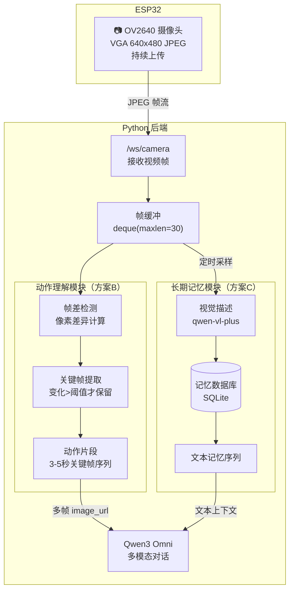

# 视频理解方案：让猫理解"主人刚才在做什么"

> 目标：让桌面 AI 猫能理解**需要时间维度**的场景，例如"主人刚才在跳舞"、"主人正在做什么动作"、"主人刚才经历了什么"。

---

## 一、方案总览

| 方案 | 原理 | 时间维度 | 成本 | 延迟 | 推荐度 |
|------|------|---------|------|------|--------|
| **方案 A：多帧拼接** | 发送最近 3-5 帧给 LLM | 短时（1-2秒） | 中 | 低 | ⭐⭐⭐ |
| **方案 B：关键帧提取** | 帧差检测，只保留变化大的帧 | 中时（5-10秒） | 中 | 低 | ⭐⭐⭐⭐ |
| **方案 C：视频描述管道** | 定时抓帧→视觉模型描述→文本序列 | 长时（分钟级） | 低 | 高 | ⭐⭐⭐⭐ |
| **方案 D：视频理解模型** | 上传短视频片段给视频模型 | 完整 | 高 | 高 | ⭐⭐ |

**推荐组合：方案 B（实时动作理解）+ 方案 C（长期活动记忆）**

---

## 二、整体架构



---

## 三、方案 B：关键帧提取 + 动作片段（实时动作理解）

### 3.1 核心思路

```
持续接收视频帧
    ↓
计算相邻帧差异（像素级）
    ↓
差异 > 阈值 → 保存为关键帧
    ↓
收集 3-5 个关键帧组成"动作片段"
    ↓
用户说话时，把动作片段（多帧图片）发给 LLM
```

### 3.2 帧差检测实现

```python
# motion_analyzer.py
# -*- coding: utf-8 -*-
"""
动作理解模块：帧差检测 + 关键帧提取 + 动作片段组装
"""
import cv2
import numpy as np
import time
from collections import deque
from typing import Deque, List, Optional, Tuple

# 配置
DIFF_THRESHOLD = 25.0        # 帧差阈值（像素平均差异）
MIN_FRAME_INTERVAL = 0.3     # 最小关键帧间隔（秒），避免连拍
MAX_CLIP_FRAMES = 5          # 一个动作片段最多几帧
CLIP_WINDOW_SEC = 5.0        # 动作片段时间窗口（秒）
SAMPLE_INTERVAL = 0.5        # 采样间隔（秒），降低计算量


class MotionAnalyzer:
    """帧差检测 + 关键帧提取"""

    def __init__(self):
        self._prev_gray: Optional[np.ndarray] = None
        self._prev_time: float = 0.0
        self._keyframes: Deque[Tuple[float, bytes]] = deque(maxlen=MAX_CLIP_FRAMES)
        self._motion_level: float = 0.0
        self._last_sample: float = 0.0

    def process_frame(self, jpeg_bytes: bytes) -> Optional[bytes]:
        """
        处理一帧 JPEG，返回是否应保存为关键帧。
        返回 None = 不是关键帧；返回 bytes = 关键帧 JPEG。
        """
        now = time.time()
        # 采样间隔控制，避免每帧都解码（CPU 开销大）
        if now - self._last_sample < SAMPLE_INTERVAL:
            return None
        self._last_sample = now

        # 解码 JPEG → 灰度图
        try:
            buf = np.frombuffer(jpeg_bytes, dtype=np.uint8)
            img = cv2.imdecode(buf, cv2.IMREAD_GRAYSCALE)
            if img is None:
                return None
            # 缩小到 160x120，降低计算量
            img = cv2.resize(img, (160, 120))
        except Exception:
            return None

        # 计算帧差
        if self._prev_gray is not None:
            diff = cv2.absdiff(self._prev_gray, img)
            self._motion_level = float(diff.mean())
        else:
            self._motion_level = 0.0
        self._prev_gray = img

        # 判断是否关键帧
        if self._motion_level > DIFF_THRESHOLD and (now - self._prev_time) >= MIN_FRAME_INTERVAL:
            self._prev_time = now
            self._keyframes.append((now, jpeg_bytes))
            return jpeg_bytes
        return None

    def get_motion_level(self) -> float:
        """当前运动强度（0-255）"""
        return self._motion_level

    def get_action_clip(self) -> List[bytes]:
        """获取当前动作片段（最近的关键帧序列）"""
        return [frame for _, frame in self._keyframes]

    def is_motion_active(self) -> bool:
        """是否正在发生动作"""
        return self._motion_level > DIFF_THRESHOLD

    def reset(self):
        self._prev_gray = None
        self._keyframes.clear()
        self._motion_level = 0.0
```

### 3.3 接入现有代码

```python
# app.py 中接入
from motion_analyzer import MotionAnalyzer

motion_analyzer = MotionAnalyzer()

# 在 /ws/camera 接收帧时
@app.websocket("/ws/camera")
async def ws_camera_esp(ws: WebSocket):
    global esp32_camera_ws
    esp32_camera_ws = ws
    await ws.accept()
    try:
        while True:
            msg = await ws.receive()
            if "bytes" in msg and msg["bytes"]:
                data = msg["bytes"]
                last_frames.append((time.time(), data))
                # 帧差检测，提取关键帧
                motion_analyzer.process_frame(data)
                _enqueue_frame_to_viewers(data)
    except WebSocketDisconnect:
        pass
    finally:
        esp32_camera_ws = None
```

### 3.4 对话时发送动作片段

```python
# start_ai_with_text 中，把单帧改为多帧
async def start_ai_with_text(user_text: str):
    content_list = []

    # 方案B：发送动作片段（多帧）
    clip = motion_analyzer.get_action_clip()
    if clip:
        # 最多取 5 帧，按时间顺序
        for jpeg_bytes in clip[-5:]:
            img_b64 = base64.b64encode(jpeg_bytes).decode("ascii")
            content_list.append({
                "type": "image_url",
                "image_url": {"url": f"data:image/jpeg;base64,{img_b64}"}
            })
        print(f"[AI] 使用动作片段：{len(clip)} 帧", flush=True)
    elif last_frames:
        # 没有动作时，退回单帧
        _, jpeg_bytes = last_frames[-1]
        img_b64 = base64.b64encode(jpeg_bytes).decode("ascii")
        content_list.append({
            "type": "image_url",
            "image_url": {"url": f"data:image/jpeg;base64,{img_b64}"}
        })

    content_list.append({"type": "text", "text": user_text})
    # ... 原有逻辑 ...
```

### 3.5 系统提示词增强

```python
# omni_client.py 中增强系统提示词
SYSTEM_PROMPT = """你是一匹活泼可爱的小马，名字叫"卧地马"，是一个桌面AI宠物。

【视觉理解】
- 你会收到多张连续的照片（动作片段），它们按时间顺序排列
- 请观察这些照片中主人正在做什么动作（跳舞、挥手、写字、吃东西等）
- 如果多张照片显示同一个动作，说明主人在持续做这件事
- 结合动作和对话内容自然回应，例如：
  - 看到主人在跳舞 → "哇！主人跳舞好开心呀！"
  - 看到主人在写字 → "主人认真写东西的样子真好看~"
  - 看到主人在吃东西 → "看起来好好吃呀，我也想吃！"

【原有性格设定】
- ...（保留原有内容）"""
```

---

## 四、方案 C：视频描述管道（长期活动记忆）

### 4.1 核心思路

```
每 10 秒抓一帧
    ↓
用 qwen-vl-plus 描述成一句话
    ↓
存入 SQLite（带时间戳）
    ↓
对话时把最近 N 条描述作为文本上下文
    ↓
LLM 能回答"主人刚才在做什么"
```

### 4.2 实现代码

```python
# activity_memory.py
# -*- coding: utf-8 -*-
"""
长期活动记忆：定时抓帧 → 视觉描述 → 文本记忆
"""
import asyncio
import os
import time
import sqlite3
from typing import Any, Dict, List, Optional

from omni_client import describe_image_async

# 配置
MEMORY_DB = os.path.join(os.path.dirname(os.path.abspath(__file__)), "data", "activity_memory.db")
DESCRIBE_INTERVAL = 10.0     # 每 10 秒描述一次
MEMORY_MAX_ENTRIES = 200     # 最多保留 200 条记忆
MEMORY_CONTEXT_LIMIT = 30    # 对话时使用最近 30 条


class ActivityMemory:
    def __init__(self):
        os.makedirs(os.path.dirname(MEMORY_DB), exist_ok=True)
        self._conn = sqlite3.connect(MEMORY_DB, check_same_thread=False)
        self._conn.execute("""
            CREATE TABLE IF NOT EXISTS activity_memory (
                id          INTEGER PRIMARY KEY AUTOINCREMENT,
                timestamp   REAL NOT NULL,
                time_label  TEXT NOT NULL,
                description TEXT NOT NULL,
                image_path  TEXT
            )
        """)
        self._conn.commit()
        self._task: Optional[asyncio.Task] = None
        self._active = False

    async def start(self):
        """启动定时描述任务"""
        if self._task and not self._task.done():
            return
        self._active = True
        self._task = asyncio.create_task(self._loop())

    async def stop(self):
        self._active = False
        if self._task:
            self._task.cancel()
            try:
                await self._task
            except asyncio.CancelledError:
                pass
            self._task = None

    async def _loop(self):
        while self._active:
            try:
                await self._tick()
            except Exception as exc:
                print(f"[MEMORY] tick failed: {exc}", flush=True)
            await asyncio.sleep(DESCRIBE_INTERVAL)

    async def _tick(self):
        """抓一帧 → 描述 → 存库"""
        from app import last_frames  # 避免循环导入
        if not last_frames:
            return
        _, jpeg_bytes = last_frames[-1]

        # 调用视觉模型描述
        description = await describe_image_async(jpeg_bytes)
        if not description or "没有看清" in description:
            return

        now = time.time()
        self._conn.execute(
            "INSERT INTO activity_memory (timestamp, time_label, description) VALUES (?, ?, ?)",
            (now, time.strftime("%H:%M:%S", time.localtime(now)), description),
        )
        self._conn.commit()

        # 清理旧记录
        self._conn.execute(
            "DELETE FROM activity_memory WHERE id NOT IN (SELECT id FROM activity_memory ORDER BY id DESC LIMIT ?)",
            (MEMORY_MAX_ENTRIES,),
        )
        self._conn.commit()
        print(f"[MEMORY] {time.strftime('%H:%M:%S')} {description}", flush=True)

    def get_recent_context(self, limit: int = MEMORY_CONTEXT_LIMIT) -> str:
        """获取最近的活动描述文本"""
        rows = self._conn.execute(
            "SELECT time_label, description FROM activity_memory ORDER BY id DESC LIMIT ?",
            (limit,),
        ).fetchall()
        lines = [f"[{t}] {d}" for t, d in reversed(rows)]
        return "\n".join(lines) if lines else "（还没有活动记录）"


# 全局单例
activity_memory = ActivityMemory()
```

### 4.3 对话时注入记忆上下文

```python
# start_ai_with_text 中注入
async def start_ai_with_text(user_text: str):
    content_list = []

    # 方案C：注入长期活动记忆（文本）
    memory_context = activity_memory.get_recent_context()
    if memory_context and memory_context != "（还没有活动记录）":
        content_list.append({
            "type": "text",
            "text": f"【最近活动记录】\n{memory_context}\n\n"
        })

    # 方案B：动作片段（多帧）
    clip = motion_analyzer.get_action_clip()
    if clip:
        for jpeg_bytes in clip[-5:]:
            img_b64 = base64.b64encode(jpeg_bytes).decode("ascii")
            content_list.append({
                "type": "image_url",
                "image_url": {"url": f"data:image/jpeg;base64,{img_b64}"}
            })

    content_list.append({"type": "text", "text": user_text})
    # ... 原有逻辑 ...
```

---

## 五、方案 A：多帧拼接（最简单，快速见效）

如果不想引入帧差检测，可以直接把 `last_frames` 中的最近几帧发给 LLM：

```python
# 最简单版：直接发最近 3 帧
async def start_ai_with_text(user_text: str):
    content_list = []

    # 取最近 3 帧（间隔采样，避免太相似）
    frames = list(last_frames)[-6:]  # 取最近 6 帧
    sampled = frames[::2][-3:]       # 隔帧采样，取 3 帧

    for _, jpeg_bytes in sampled:
        img_b64 = base64.b64encode(jpeg_bytes).decode("ascii")
        content_list.append({
            "type": "image_url",
            "image_url": {"url": f"data:image/jpeg;base64,{img_b64}"}
        })

    content_list.append({"type": "text", "text": user_text})
    # ... 原有逻辑 ...
```

**优点**：改动最小，几行代码
**缺点**：帧可能太相似（如果画面静止），浪费 token

---

## 六、方案 D：视频理解模型（最强但成本高）

### 6.1 原理

使用支持视频输入的模型（如 `qwen-vl-max` 的视频理解能力），上传短视频片段：

```python
# video_understanding.py
# -*- coding: utf-8 -*-
"""
视频理解：收集短视频片段，上传给视频理解模型
"""
import base64
import io
import time
from typing import List, Optional

from openai import OpenAI

VIDEO_MODEL = "qwen-vl-max"  # 支持视频理解的模型
CLIP_DURATION = 5.0          # 视频片段时长（秒）
FPS = 2                      # 采样帧率（每秒几帧）


def build_video_clip(frames: List[bytes], fps: int = FPS) -> str:
    """
    将多帧 JPEG 组装成视频理解的输入。
    使用 OpenAI 兼容格式：多帧 image_url 序列。
    """
    content = []
    for jpeg_bytes in frames:
        b64 = base64.b64encode(jpeg_bytes).decode("ascii")
        content.append({
            "type": "image_url",
            "image_url": {"url": f"data:image/jpeg;base64,{b64}"}
        })
    return content


async def understand_video(frames: List[bytes], question: str) -> str:
    """让视频理解模型分析动作片段"""
    client = OpenAI(
        api_key=os.getenv("DASHSCOPE_API_KEY"),
        base_url="https://dashscope.aliyuncs.com/compatible-mode/v1",
    )
    content = build_video_clip(frames)
    content.append({"type": "text", "text": question})

    completion = client.chat.completions.create(
        model=VIDEO_MODEL,
        messages=[
            {
                "role": "system",
                "content": "你是动作分析专家。观察这组连续照片，判断主人在做什么动作。"
                           "照片按时间顺序排列。用一句话回答。",
            },
            {"role": "user", "content": content},
        ],
        stream=False,
    )
    return completion.choices[0].message.content or ""
```

### 6.2 触发时机

```python
# 检测到用户说话时，收集最近 5 秒的关键帧
async def on_user_speech():
    frames = motion_analyzer.get_action_clip()
    if len(frames) >= 3:
        # 有动作 → 用视频理解
        action = await understand_video(frames, "主人在做什么动作？")
        print(f"[VIDEO] 动作理解: {action}")
        # 把动作描述注入对话
        await start_ai_with_text(f"（我看到主人{action}）{user_text}")
```

---

## 七、推荐实现路线

### 阶段 1：快速见效（1-2 小时）
- 实现**方案 A**：多帧拼接，改动最小
- 增强系统提示词，告诉 LLM 会收到多帧

### 阶段 2：动作理解（半天）
- 实现**方案 B**：帧差检测 + 关键帧提取
- 接入 `/ws/camera` 帧流
- 对话时发送动作片段

### 阶段 3：长期记忆（1 天）
- 实现**方案 C**：定时描述 + SQLite 存储
- 对话时注入记忆上下文
- 配合持久化方案（`docs/持久化设计方案.md`）

### 阶段 4：进阶（可选）
- 实现**方案 D**：视频理解模型
- 结合动作片段做更精准的动作识别

---

## 八、成本估算

| 方案 | 每次对话 token 消耗 | 额外 API 调用 | 估算成本/天 |
|------|-------------------|--------------|------------|
| 当前（单帧） | ~1 帧 ≈ 1000 tokens | 0 | 低 |
| 方案 A（多帧） | 3 帧 ≈ 3000 tokens | 0 | 中 |
| 方案 B（关键帧） | 3-5 帧 ≈ 3000-5000 tokens | 0 | 中 |
| 方案 C（记忆） | 文本 ≈ 500 tokens | 每 10 秒 1 次视觉描述 | 高（持续调用） |
| 方案 D（视频） | 视频片段 ≈ 5000+ tokens | 每次对话 1 次 | 高 |

**优化建议**：
- 方案 C 的 `DESCRIBE_INTERVAL` 可调大（如 30 秒），降低成本
- 方案 C 只在检测到动作时才描述（结合方案 B 的 `is_motion_active()`）
- 方案 B 的 `DIFF_THRESHOLD` 可调，减少关键帧数量

---

## 九、文件结构

```
upload_facial_expression/integrated/server/
├── app.py                    # 主服务（接入方案B/C）
├── motion_analyzer.py        # 新增：帧差检测 + 关键帧提取
├── activity_memory.py        # 新增：长期活动记忆
├── video_understanding.py    # 新增（可选）：视频理解模型
├── omni_client.py            # 修改：增强系统提示词
├── data/
│   └── activity_memory.db    # 活动记忆数据库
└── ...
```
