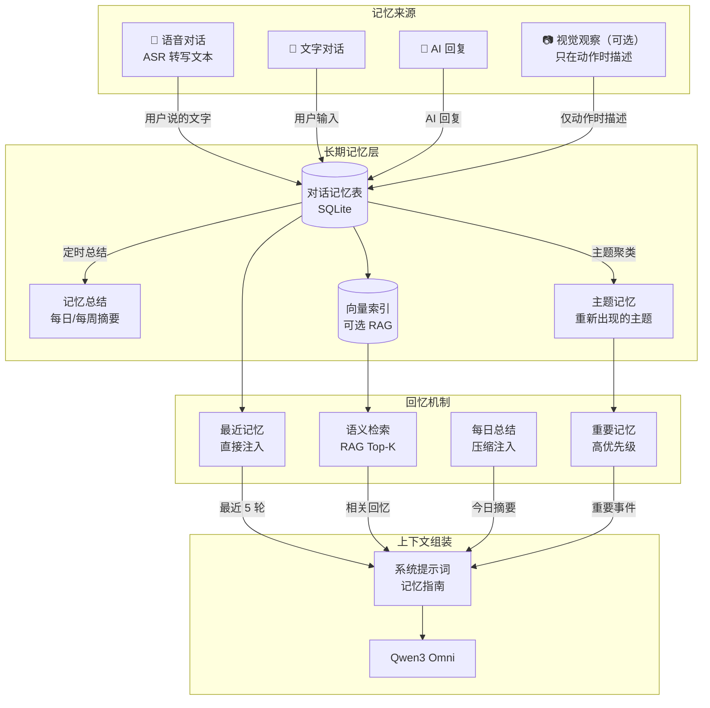

# 长期记忆方案：以对话/语音为核心，视频为辅

> 你的判断完全正确：**视频/图像数据占空间大、token 消耗高、持续视觉调用的成本也不低**。
> 长期记忆最应该依赖的是**对话内容和语音转写文本**——它们轻量、高价值、天然就是"语义"。
> 本文档设计一套以对话为核心、视觉为辅的长期记忆系统。

---

## 一、为什么对话/语音比视频更适合做长期记忆

| 维度 | 对话/语音（ASR 转文本） | 视频/图像 |
|------|------------------------|-----------|
| **数据量** | 一条对话 ~50-200 字符 | 一帧 JPEG ~20-50KB |
| **存储** | SQLite 一行文本 | 需要文件系统 + 数据库 |
| **语义价值** | 天然是语义（文字） | 需要视觉模型转换才有语义 |
| **Token 消耗** | 极低（几百 token） | 每帧 ~1000 token |
| **检索** | 直接文本匹配/向量化 | 需先描述再向量化 |
| **成本** | 几乎为零 | 每帧都要调用视觉模型 |
| **隐私** | 只有文字，无画面 | 可能拍到敏感画面 |

### 核心洞察

> **对话/语音已经是"提炼过的记忆"**。
> 主人说"我今天去跑步了"→ AI 回复"好棒呀！"——这段对话本身就包含了完整语义，不需要看视频就知道发生了什么。
> 视频的价值只在于**主人没说话时的画面**（如"看到主人在跳舞"），而这只是"额外的补充记忆"。

---

## 二、整体架构



---

## 三、记忆体系设计

### 3.1 记忆分级

```
┌─────────────────────────────────────────────┐
│  L1 工作记忆（会话内）                        │
│  最近 5-10 轮对话，直接注入上下文              │
│  存在内存，会话结束即清理                      │
├─────────────────────────────────────────────┤
│  L2 近期记忆（数天）                          │
│  全部对话存入 SQLite                          │
│  对话时注入"今日摘要" + "最近3天重点"          │
├─────────────────────────────────────────────┤
│  L3 长期记忆（周/月）                         │
│  每日自动生成摘要，每周整合                    │
│  只保留摘要 + 高重要性对话                    │
│  通过 RAG 语义检索按需召回                    │
└─────────────────────────────────────────────┘
```

### 3.2 记忆数据结构

```sql
-- 对话记忆表（核心）
CREATE TABLE IF NOT EXISTS conversations (
    id          INTEGER PRIMARY KEY AUTOINCREMENT,
    session_id  TEXT NOT NULL,              -- 日期会话：20260808
    role        TEXT NOT NULL,              -- 'user' / 'ai'
    content     TEXT NOT NULL,              -- 对话文本
    emotion     TEXT,                       -- 情绪标签
    topic       TEXT,                       -- 主题标签（可选）
    importance  INTEGER DEFAULT 0,          -- 重要性 0-5
    created_at  REAL NOT NULL
);

-- 每日摘要表
CREATE TABLE IF NOT EXISTS daily_summaries (
    date        TEXT PRIMARY KEY,           -- 20260808
    summary     TEXT NOT NULL,              -- 当日对话摘要
    topics      TEXT,                       -- JSON: 涉及主题
    key_events  TEXT,                       -- JSON: 重要事件
    created_at  REAL NOT NULL
);

-- 重要记忆表（长期）
CREATE TABLE IF NOT EXISTS important_memories (
    id          INTEGER PRIMARY KEY AUTOINCREMENT,
    content     TEXT NOT NULL,              -- 记忆内容
    category    TEXT,                       -- 分类：喜好/事件/人物/约定
    importance  INTEGER DEFAULT 3,          -- 重要性 1-5
    source      TEXT,                       -- 来源：对话/语音/视觉
    created_at  REAL NOT NULL
);

-- 用户画像表（长期积累）
CREATE TABLE IF NOT EXISTS user_profile (
    id          INTEGER PRIMARY KEY AUTOINCREMENT,
    attribute   TEXT NOT NULL,              -- 属性：name/occupation/likes/...
    value       TEXT NOT NULL,              -- 值
    confidence  REAL DEFAULT 0.5,           -- 置信度 0-1
    updated_at  REAL NOT NULL
);
```

---

## 四、核心模块：`memory.py`

```python
# memory.py
# -*- coding: utf-8 -*-
"""
长期记忆系统：以对话/语音为核心
- L1 工作记忆：最近对话（内存）
- L2 近期记忆：全部对话（SQLite）+ 今日摘要
- L3 长期记忆：每日总结 + 重要事件 + 用户画像
"""
import json
import os
import sqlite3
import threading
import time
from collections import deque
from typing import Any, Dict, List, Optional

# ===== 配置 =====
DATA_DIR = os.path.join(os.path.dirname(os.path.abspath(__file__)), "data")
DB_PATH = os.path.join(DATA_DIR, "memory.db")
WORKING_MEMORY_LEN = 10          # L1: 工作记忆保留最近几轮
IMPORTANT_KEYWORDS = [           # 触发"重要记忆"的关键词
    "生日", "名字", "喜欢", "讨厌", "害怕", "约定",
    "记住", "别忘了", "计划", "工作", "考试", "手术",
]

class LongTermMemory:
    """长期记忆管理器"""

    def __init__(self):
        os.makedirs(DATA_DIR, exist_ok=True)
        self._conn = sqlite3.connect(DB_PATH, check_same_thread=False)
        self._conn.execute("PRAGMA journal_mode=WAL")
        self._init_tables()
        # L1: 工作记忆（内存）
        self._working: deque = deque(maxlen=WORKING_MEMORY_LEN * 2)
        self._lock = threading.Lock()

    def _init_tables(self):
        self._conn.executescript("""
            CREATE TABLE IF NOT EXISTS conversations (
                id          INTEGER PRIMARY KEY AUTOINCREMENT,
                session_id  TEXT NOT NULL,
                role        TEXT NOT NULL,
                content     TEXT NOT NULL,
                emotion     TEXT,
                created_at  REAL NOT NULL
            );
            CREATE TABLE IF NOT EXISTS daily_summaries (
                date        TEXT PRIMARY KEY,
                summary     TEXT NOT NULL,
                topics      TEXT,
                created_at  REAL NOT NULL
            );
            CREATE TABLE IF NOT EXISTS important_memories (
                id          INTEGER PRIMARY KEY AUTOINCREMENT,
                content     TEXT NOT NULL,
                category    TEXT,
                importance  INTEGER DEFAULT 3,
                created_at  REAL NOT NULL
            );
            CREATE INDEX IF NOT EXISTS idx_conv_session ON conversations(session_id);
            CREATE INDEX IF NOT EXISTS idx_conv_time ON conversations(created_at);
        """)
        self._conn.commit()

    # ========== L1: 工作记忆（内存） ==========
    def add_dialogue(self, role: str, content: str, emotion: str = None):
        """添加一条对话到工作记忆 + 写入 SQLite"""
        now = time.time()
        self._working.append({
            "role": role, "content": content,
            "emotion": emotion, "time": now,
        })
        # 写入数据库
        with self._lock:
            self._conn.execute(
                "INSERT INTO conversations (session_id, role, content, emotion, created_at) VALUES (?,?,?,?,?)",
                (time.strftime("%Y%m%d"), role, content, emotion, now),
            )
            self._conn.commit()

        # 检测重要记忆
        self._check_important(content)

    def get_working_context(self) -> str:
        """组装 L1 工作记忆上下文"""
        if not self._working:
            return ""
        lines = []
        for item in self._working:
            speaker = "主人" if item["role"] == "user" else "卧地马"
            lines.append(f"{speaker}: {item['content']}")
        return "\n".join(lines)

    # ========== L2: 近期记忆（SQLite） ==========
    def get_recent_conversations(self, limit: int = 20) -> List[Dict[str, Any]]:
        """获取最近对话"""
        rows = self._conn.execute(
            "SELECT role, content, emotion, created_at FROM conversations ORDER BY id DESC LIMIT ?",
            (limit,),
        ).fetchall()
        return [dict(zip(["role", "content", "emotion", "created_at"], r)) for r in reversed(rows)]

    def get_today_summary(self) -> str:
        """获取今日摘要"""
        row = self._conn.execute(
            "SELECT summary FROM daily_summaries WHERE date = ?",
            (time.strftime("%Y%m%d"),),
        ).fetchone()
        if not row:
            return ""
        return f"【今日摘要】{row[0]}"

    def get_recent_summary(self, days: int = 3) -> str:
        """获取最近 N 天的摘要"""
        import datetime
        cutoff = (datetime.date.today() - datetime.timedelta(days=days)).strftime("%Y%m%d")
        rows = self._conn.execute(
            "SELECT date, summary FROM daily_summaries WHERE date >= ? ORDER BY date",
            (cutoff,),
        ).fetchall()
        if not rows:
            return ""
        lines = [f"[{d}] {s}" for d, s in rows]
        return "【近期回顾】\n" + "\n".join(lines)

    # ========== L3: 长期记忆 ==========
    def _check_important(self, text: str):
        """检测是否包含重要信息"""
        for kw in IMPORTANT_KEYWORDS:
            if kw in text:
                self.add_important(text, category="对话")
                break

    def add_important(self, content: str, category: str = "对话", importance: int = 3):
        """添加重要记忆"""
        with self._lock:
            self._conn.execute(
                "INSERT INTO important_memories (content, category, importance, created_at) VALUES (?,?,?,?)",
                (content, category, importance, time.time()),
            )
            self._conn.commit()

    def get_important_memories(self, limit: int = 5) -> List[Dict[str, Any]]:
        """获取重要记忆"""
        rows = self._conn.execute(
            "SELECT content, category, importance FROM important_memories ORDER BY importance DESC, id DESC LIMIT ?",
            (limit,),
        ).fetchall()
        return [dict(zip(["content", "category", "importance"], r)) for r in rows]

    # ========== 每日总结（LLM 生成） ==========
    async def generate_daily_summary(self):
        """用 LLM 生成今日对话摘要"""
        today = time.strftime("%Y%m%d")
        # 获取今日所有对话
        rows = self._conn.execute(
            "SELECT role, content FROM conversations WHERE session_id = ? ORDER BY id",
            (today,),
        ).fetchall()
        if not rows:
            return

        # 组装对话文本
        dialogue = "\n".join(
            f"{'主人' if r[0] == 'user' else '卧地马'}: {r[1]}" for r in rows
        )

        # 调用 LLM 生成摘要
        from omni_client import plain_text_async
        summary = await plain_text_async(
            "你是记忆整理助手。根据今天的对话，生成一段简洁的摘要（3-5句话），"
            "总结今天聊了什么、主人的喜好/计划/重要事件。不要编造。",
            dialogue,
        )

        # 保存摘要
        with self._lock:
            self._conn.execute(
                "INSERT OR REPLACE INTO daily_summaries (date, summary, created_at) VALUES (?,?,?)",
                (today, summary, time.time()),
            )
            self._conn.commit()
        print(f"[MEMORY] 今日摘要已生成: {summary}", flush=True)

    # ========== 上下文组装 ==========
    def build_context(self, user_text: str) -> str:
        """组装完整记忆上下文"""
        parts = []

        # L1: 工作记忆（最近对话）
        working = self.get_working_context()
        if working:
            parts.append(f"【最近对话】\n{working}")

        # L2: 今日摘要 + 近期回顾
        today = self.get_today_summary()
        if today:
            parts.append(today)
        recent = self.get_recent_summary(days=3)
        if recent:
            parts.append(recent)

        # L3: 重要记忆
        important = self.get_important_memories(limit=5)
        if important:
            lines = [f"- {m['content']}" for m in important]
            parts.append("【重要记忆】\n" + "\n".join(lines))

        return "\n\n".join(parts) if parts else ""


# 全局单例
memory = LongTermMemory()
```

---

## 五、接入现有代码

### 5.1 记录对话（`app.py` 的 `start_ai_with_text`）

```python
# 在 start_ai_with_text 中接入
from memory import memory

async def start_ai_with_text(user_text: str):
    # 记录用户消息
    memory.add_dialogue("user", user_text)

    # 组装记忆上下文
    memory_context = memory.build_context(user_text)

    # 组装 content_list
    content_list = []
    if memory_context:
        content_list.append({
            "type": "text",
            "text": f"{memory_context}\n\n"
        })

    # 视觉（可选，只在有动作时）
    clip = motion_analyzer.get_action_clip()
    if clip:
        for jpeg_bytes in clip[-3:]:
            img_b64 = base64.b64encode(jpeg_bytes).decode("ascii")
            content_list.append({
                "type": "image_url",
                "image_url": {"url": f"data:image/jpeg;base64,{img_b64}"}
            })

    content_list.append({"type": "text", "text": user_text})

    # ... 原有逻辑 ...

    # 记录 AI 回复（流式结束后）
    final_text = ("".join(txt_buf)).strip() or "（空响应）"
    memory.add_dialogue("ai", final_text, emotion=emotion)
```

### 5.2 每日总结任务

```python
# app.py 启动时
import asyncio
from memory import memory

async def daily_summary_task():
    """每天 23:00 生成今日摘要"""
    while True:
        now = time.localtime()
        # 计算到下一个 23:00 的秒数
        next_run = time.mktime((now.tm_year, now.tm_mon, now.tm_mday, 23, 0, 0, 0, 0, -1))
        if next_run <= time.time():
            next_run += 86400
        await asyncio.sleep(next_run - time.time())
        await memory.generate_daily_summary()

# 启动时创建任务
asyncio.create_task(daily_summary_task())
```

### 5.3 系统提示词增强

```python
SYSTEM_PROMPT = """你是一匹活泼可爱的小马，名字叫"卧地马"，是一个桌面AI宠物。

【记忆能力】
- 你会收到【最近对话】【今日摘要】【重要记忆】等上下文
- 这些是之前和主人的对话记录，请自然引用它们
- 例如：
  - 主人问"我昨天说了什么？" → 参考最近对话回答
  - 主人问"我上次说喜欢什么？" → 参考重要记忆回答
  - 主人说"我上周说要减肥" → 从记忆中确认并鼓励
- 如果记忆中没有相关信息，诚实说"我好像没记住呢"
- 不要暴露"记忆"这个词，自然地说"我记得..."或"你之前说过..."

【原有性格设定】
- ...（保留原有内容）"""
```

---

## 六、记忆触发策略

### 6.1 什么时候写入记忆

| 时机 | 内容 | 优先级 |
|------|------|--------|
| 用户每次说话 | ASR 转写文本 | 必写 |
| AI 每次回复 | 回复文本 + 情绪 | 必写 |
| 检测到重要关键词 | 单独存入重要记忆 | 高 |
| 视觉动作（可选） | 只在 `is_motion_active()` 时描述 | 低 |

### 6.2 什么时候注入记忆

| 时机 | 注入内容 | 说明 |
|------|---------|------|
| 每次对话 | L1 工作记忆（最近 5-10 轮） | 保持连贯 |
| 每次对话 | L3 重要记忆（Top-5） | 记住关键信息 |
| 每次对话 | L2 今日摘要 + 近 3 天回顾 | 跨天记忆 |
| 用户问"记得/之前/上次" | RAG 语义检索 | 精准召回 |

### 6.3 记忆压缩策略

```
原始对话（无限增长）
    ↓ 每天 23:00
每日摘要（压缩 90%）
    ↓ 每周日
每周总结（进一步压缩）
    ↓ 每月
月度画像（用户偏好/习惯/重要事件）
```

---

## 七、成本对比

| 方案 | 存储 | 每次对话 token | 额外 API 调用 | 成本/天 |
|------|------|---------------|--------------|---------|
| **对话记忆（本方案）** | SQLite 文本 | ~500-1000 | 每日 1 次摘要 | **极低** |
| 视频帧记忆 | 文件 + 数据库 | ~3000-5000 | 每帧视觉描述 | 高 |
| 关键帧 + RAG | 向量库 + 文件 | ~2000-3000 | 每帧视觉描述 + 检索 | 中高 |
| 视频理解模型 | 文件 | ~5000+ | 每次对话视频分析 | 很高 |

**本方案优势**：
- 存储：纯文本，几 MB 可存一年对话
- Token：只注入摘要和重要记忆，不注入全部历史
- API：只有每日 1 次摘要调用，成本可忽略
- 隐私：不保存画面，只保存文字

---

## 八、配置项（`.env`）

```bash
# 长期记忆配置
MEMORY_ENABLED=1              # 是否启用长期记忆
MEMORY_WORKING_LEN=10         # 工作记忆保留轮数
MEMORY_IMPORTANT_KEYWORDS=生日,名字,喜欢,讨厌,害怕,约定,记住,别忘了,计划,工作,考试,手术
MEMORY_DAILY_SUMMARY_HOUR=23  # 每日摘要生成时间
MEMORY_RECENT_DAYS=3          # 注入最近几天摘要
MEMORY_IMPORTANT_LIMIT=5      # 注入重要记忆条数
```

---

## 九、总结

**以对话/语音为核心的长期记忆是最优解**：

1. **数据轻量**：纯文本存储，一年对话才几 MB
2. **语义天然**：对话本身就是"提炼过的记忆"，不需要额外转换
3. **成本极低**：只有每日 1 次摘要调用，几乎零成本
4. **隐私友好**：不保存画面，只保存文字
5. **检索精准**：用户问"我上次说喜欢什么"，直接查重要记忆表

**视频/图像只作为"补充记忆"**：
- 只在检测到动作时（`is_motion_active()`）才描述
- 描述结果作为文本存入对话记忆表
- 不保存原始视频帧（除非用户明确要求）

**记忆分级**：
```
L1 工作记忆（内存）→ 最近对话，保持连贯
L2 近期记忆（SQLite）→ 今日摘要 + 近 3 天回顾
L3 长期记忆（SQLite）→ 重要事件 + 用户画像 + 每日总结
```
